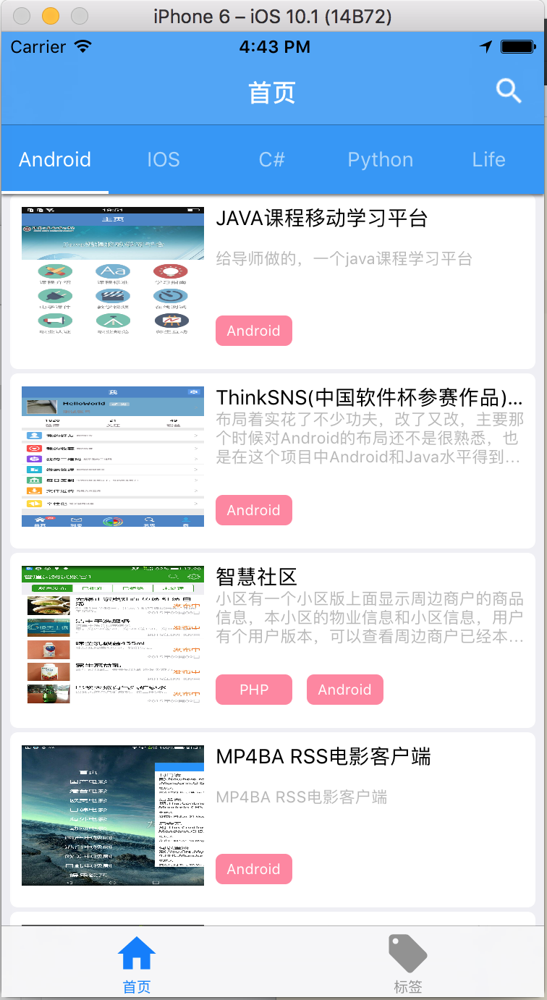
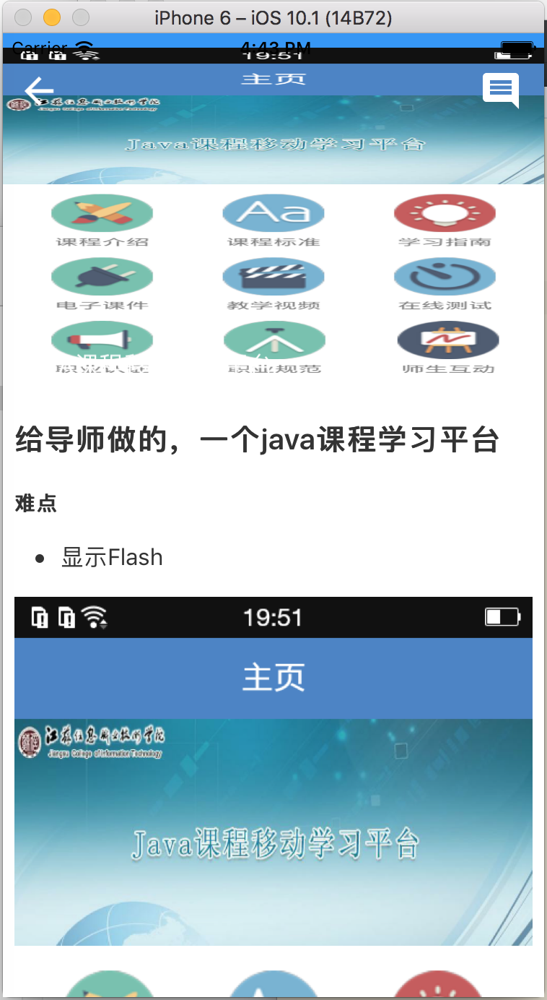
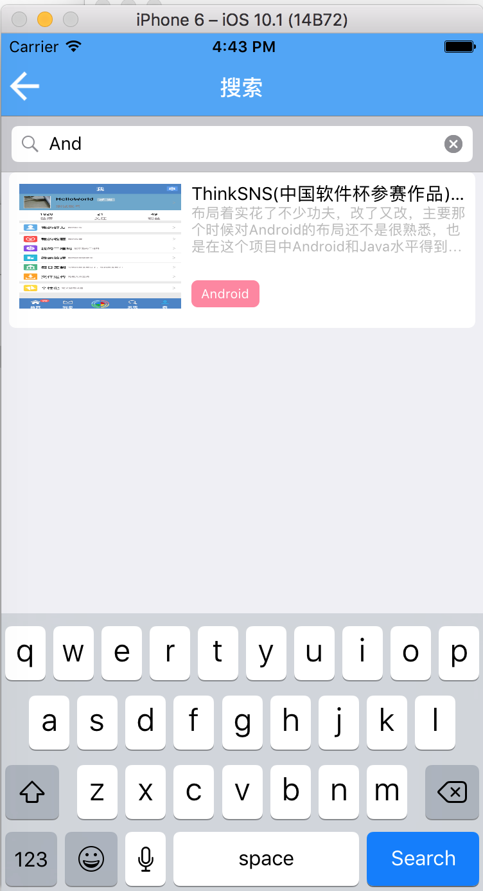

#安装
- 运行```pod update```
- 打开Blog.xcworkspace

#使用到的三方:
- AFNetworking网络请求
- YYModel将类似android中的GSON将json转换为对象
- MaterialControls Material Design设计风格
- SDWebImage图片处理
- MJRefresh 下拉刷新
- Masonry设置约束
- BLKFlexibleHeightBar标签实现
- MBProgressHUD加载动画

#图片




###其他链接:
- [前/后端/Api](https://github.com/csi0n/Ace-Admin-Blog)
- [Android版本](https://github.com/csi0n/Ace-Admin-Blog-Android)
- [IOS版本](https://github.com/csi0n/Ace-Admin-Blog-IOS)
- 后续还会有别的版本RN,Swift,kotlin....敬请期待.

enjoy it :)


